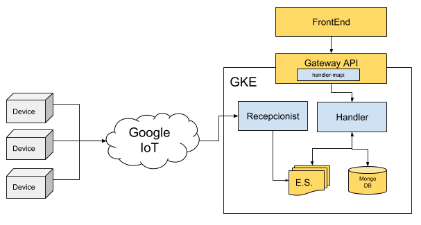

# Devices Report MicroService
The general porpouse of this service is to listen, format and publish data coming from Embedded Devices.  
This process is handle by two subprocess:
 * recepcionist: listen to incoming reports from every embedded devices throught the IoT MQTT Topic, then decompress the data and made them available to every service by publishing 'DeviceGeneralInformationReported' events to the event store.  
 * handler: listen to 'DeviceGeneralInformationReported' events on the event store, formats and normalizes the data, then creates and mantains a persistent profile of each device so it can infer status differences and publish deltas.



# Table of Contents
  * [Project Structure](#structure)
  * [FrontEnd](#frontend) - not yet available  
    *  [Environment variables](#frontend_env_vars) - not yet available  
  * [API](#api)
    * [GraphQL throught Gateway API](#api_gateway_graphql)
  * [BackEnd](#backend)
    *  [Recepcionist](#backend_recepcionist)
        *  [Environment variables](#backend_recepcionist_env_vars)
        *  [Event Sourcing](#backend_recepcionist_eventsourcing)
    *  [Handler](#backend_handler)
        *  [Environment variables](#backend_handler_env_vars)
        *  [CronJobs](#backend_handler_cronjobs)
        *  [Event Sourcing](#backend_handler_eventsourcing)
  * [Prepare development environment](#prepare_dev_env)
  * [License](#license)


# Project structure <a name="structure"></a>

```
.
├── frontend                            => Micro-FrontEnds - not yet available  
│   └── emi                             => Micro-FrontEnd for [EMI FrontEnd](https://github.com/nebulae-tpm/emi) - not yet available  
├── api                                 => Micro-APIs  
│   └── gateway                         => Micro-API for [Gateway API](https://github.com/nebulae-tpm/gateway)  
├── backend                             => Micro-BackEnds  
│   ├── devices-report-receptionist     => Micro-BackEnd responsible for publishing IoT devices reports  
│   └── devices-report-handler          => Micro-BackEnd responsible for Handling IoT devices reports published by devices-report-receptionist  
├── etc                                 => Micro-Service config Files.  
├── deployment                          => Automatic deployment strategies  
│   ├── compose                         => Docker-Compose environment for local development  
│   └── gke                             => Google Kubernetes Engine deployment file descriptors  
│   └── mapi-setup.json                 => Micro-API setup file  
├── .circleci                           => CircleCI v2. config directory
│   ├── config.yml
│   └── scripts
├── docs                                => Documentation resources  
│   └── images  
├── README.md                           => This doc
```

# API <a name="api"></a>
Exposed interfaces to send Commands and Queries by the CQRS principles.  
The MicroService exposes its interfaces as Micro-APIs that are nested on the general API.  

## GraphQL throught Gateway API <a name="api_gateway_graphql"></a>
These are the exposed GraphQL functions throught the [Gateway API](https://github.com/nebulae-tpm/gateway).  

Note: You may find the GraphQL schema [here](api/gateway/graphql/device-report-handler/schema.gql)

### getDeviceAlarmThresholds
Gets the runtime threshold values used to generate CPU, RAM, Volumes and temperature alarms.  

# BackEnd <a name="backend"></a>
Backends are defined processes within a docker container.  
Each process is responsible to build, run and maintain itself.  

Each BackEnd has the following running commands:
  * npm start: executes main program
  * npm run prepare: execute maintenance routines such DB indexes creation
  * npm run sync-state:  syncs backend state by reading all missing Events from the event-store
  * npm test: runs unit tests

## Recepcionist <a name="backend_recepcionist"></a>
Embedded devices sends reports all the time, throught the IoT MQTT service, detailing current status (Eg. CPU, RAM, MEM, IPs) and events (Eg. Location, voltage peaks).  The recepcionist gathers these reports, uncompress them and push them to the event store so it can be available to this and any other microservice.

### Environment variables <a name="backend_recepcionist_env_vars"></a>

```
+--------------------------------------+--------+----------------------------------------------------------------------------------------------+-------+-----------+
|               VARIABLE               | TYPE   |                                          DESCRIPTION                                         |  DEF. | MANDATORY |
|                                      |        |                                                                                              | VALUE |           |
+--------------------------------------+--------+----------------------------------------------------------------------------------------------+-------+-----------+
| production                           | bool   | Production enviroment flag                                                                   | false |           |
+--------------------------------------+--------+----------------------------------------------------------------------------------------------+-------+-----------+
| EVENT_STORE_BROKER_TYPE              | enum   | Event store broker type to use.                                                              |       |     X     |
|                                      | string | Ops: PUBSUB, MQTT                                                                            |       |           |
+--------------------------------------+--------+----------------------------------------------------------------------------------------------+-------+-----------+
| EVENT_STORE_BROKER_EVENTS_TOPIC      | enum   | Event store topic's name.                                                                    |       |     X     |
|                                      | string |                                                                                              |       |           |
+--------------------------------------+--------+----------------------------------------------------------------------------------------------+-------+-----------+
| EVENT_STORE_STORE_TYPE               | enum   | Event store storage type to use.                                                             |       |     X     |
|                                      | string | Ops: MONGO                                                                                   |       |           |
+--------------------------------------+--------+----------------------------------------------------------------------------------------------+-------+-----------+
| EVENT_STORE_STORE_URL                | string | Event store storage URL or connection string.                                                |       |     X     |
|                                      |        | Eg.: mongodb://127.0.0.1:27017/test                                                          |       |           |
+--------------------------------------+--------+----------------------------------------------------------------------------------------------+-------+-----------+
| EVENT_STORE_STORE_AGGREGATES_DB_NAME | string | Event store storage database name for Aggregates                                             |       |     X     |
|                                      |        | Eg.: Aggregates                                                                              |       |           |
+--------------------------------------+--------+----------------------------------------------------------------------------------------------+-------+-----------+
| EVENT_STORE_STORE_EVENTSTORE_DB_NAME | string | Event store storage database name prefix for Event Sourcing Events                           |       |     X     |
|                                      |        | Eg.: EventStore                                                                              |       |           |
+--------------------------------------+--------+----------------------------------------------------------------------------------------------+-------+-----------+
| IOT_BROKER_TYPE                      | enum   | IoT broker type to use.                                                                      |       |     X     |
|                                      | string | Ops: PUBSUB, MQTT                                                                            |       |           |
+--------------------------------------+--------+----------------------------------------------------------------------------------------------+-------+-----------+
| IOT_BROKER_TOPIC                     | string | IoT broker topic name                                                                        |       |     X     |
|                                      |        | Eg.: devices-iot                                                                             |       |           |
+--------------------------------------+--------+----------------------------------------------------------------------------------------------+-------+-----------+
| GOOGLE_APPLICATION_CREDENTIALS       | string | Production only.                                                                             |       |     X     |
|                                      |        | Google service account key path to access google cloud resources.                            |       |           |
|                                      |        |                                                                                              |       |           |
|                                      |        | Eg.: /etc/GOOGLE_APPLICATION_CREDENTIALS/gcloud-service-key.json                             |       |           |
+--------------------------------------+--------+----------------------------------------------------------------------------------------------+-------+-----------+
| LOCKVERSION                          | string | Production only.                                                                             |       |     X     |
|                                      |        | word or phrase used to evaluate if the sync task should be run before starting this backend. |       |           |
|                                      |        | This value must be changed to force state sync task.                                         |       |           |
+--------------------------------------+--------+----------------------------------------------------------------------------------------------+-------+-----------+
```

Notes: 
  * ENV VARS for development are [here](backend/devices-report-receptionist/.env)
  * ENV VARS for production are [here](deployment/gke/deployment-device-report-recepcionist.yaml)

### Event Sourcing <a name="backend_recepcionist_eventsourcing"></a>
Event sourcing events this Micro-BackEnd is subscribed to or is publishing

#### Subscribed events:
  * N/A
#### Published events:
  * DeviceGeneralInformationReported: Device report itself

## Handler <a name="backend_handler"></a>
Keeps track of the state of every device in the system, records the state on the database and compare the persited state with every new device report in order to generate system wide device events.

### Environment variables <a name="backend_handler_env_vars"></a>

```
+------------------------------------------+--------+----------------------------------------------------------------------------------------------+-------+-----------+
|                 VARIABLE                 | TYPE   |                                          DESCRIPTION                                         |  DEF. | MANDATORY |
|                                          |        |                                                                                              | VALUE |           |
+------------------------------------------+--------+----------------------------------------------------------------------------------------------+-------+-----------+
| production                               | bool   | Production enviroment flag                                                                   | false |           |
+------------------------------------------+--------+----------------------------------------------------------------------------------------------+-------+-----------+
| EVENT_STORE_BROKER_TYPE                  | enum   | Event store broker type to use.                                                              |       |     X     |
|                                          | string | Ops: PUBSUB, MQTT                                                                            |       |           |
+------------------------------------------+--------+----------------------------------------------------------------------------------------------+-------+-----------+
| EVENT_STORE_BROKER_EVENTS_TOPIC          | enum   | Event store topic's name.                                                                    |       |     X     |
|                                          | string |                                                                                              |       |           |
+------------------------------------------+--------+----------------------------------------------------------------------------------------------+-------+-----------+
| EVENT_STORE_STORE_TYPE                   | enum   | Event store storage type to use.                                                             |       |     X     |
|                                          | string | Ops: MONGO                                                                                   |       |           |
+------------------------------------------+--------+----------------------------------------------------------------------------------------------+-------+-----------+
| EVENT_STORE_STORE_URL                    | string | Event store storage URL or connection string.                                                |       |     X     |
|                                          |        | Eg.: mongodb://127.0.0.1:27017/test                                                          |       |           |
+------------------------------------------+--------+----------------------------------------------------------------------------------------------+-------+-----------+
| EVENT_STORE_STORE_AGGREGATES_DB_NAME     | string | Event store storage database name for Aggregates                                             |       |     X     |
|                                          |        | Eg.: Aggregates                                                                              |       |           |
+------------------------------------------+--------+----------------------------------------------------------------------------------------------+-------+-----------+
| EVENT_STORE_STORE_EVENTSTORE_DB_NAME     | string | Event store storage database name prefix for Event Sourcing Events                           |       |     X     |
|                                          |        | Eg.: EventStore                                                                              |       |           |
+------------------------------------------+--------+----------------------------------------------------------------------------------------------+-------+-----------+
| IOT_BROKER_TYPE                          | enum   | IoT broker type to use.                                                                      |       |     X     |
|                                          | string | Ops: PUBSUB, MQTT                                                                            |       |           |
+------------------------------------------+--------+----------------------------------------------------------------------------------------------+-------+-----------+
| IOT_BROKER_TOPIC                         | string | IoT broker topic name                                                                        |       |     X     |
|                                          |        | Eg.: devices-iot                                                                             |       |           |
+------------------------------------------+--------+----------------------------------------------------------------------------------------------+-------+-----------+
| GOOGLE_APPLICATION_CREDENTIALS           | string | Production only.                                                                             |       |     X     |
|                                          |        | Google service account key path to access google cloud resources.                            |       |           |
|                                          |        |                                                                                              |       |           |
|                                          |        | Eg.: /etc/GOOGLE_APPLICATION_CREDENTIALS/gcloud-service-key.json                             |       |           |
+------------------------------------------+--------+----------------------------------------------------------------------------------------------+-------+-----------+
| LOCKVERSION                              | string | Production only.                                                                             |       |     X     |
|                                          |        | word or phrase used to evaluate if the sync task should be run before starting this backend. |       |           |
|                                          |        | This value must be changed to force state sync task.                                         |       |           |
+------------------------------------------+--------+----------------------------------------------------------------------------------------------+-------+-----------+
| MONGODB_URL                              | string | Materialized views MONGO DB URL                                                              |       |     X     |
|                                          |        | Eg.: mongodb://127.0.0.1:27017/test                                                          |       |           |
+------------------------------------------+--------+----------------------------------------------------------------------------------------------+-------+-----------+
| MONGODB_DB_NAME                          | string | Materialized views MONGO DB name                                                             |       |     X     |
|                                          |        | Eg.: DevicesReport                                                                           |       |           |
+------------------------------------------+--------+----------------------------------------------------------------------------------------------+-------+-----------+
| JWT_PUBLIC_KEY                           | string | RSA Public key to verify JWT Tokens.                                                         |       |     X     |
|                                          |        | Format: -----BEGIN PUBLIC KEY-----\nPUBLIC_KEY\n-----END PUBLIC KEY-----                     |       |           |
+------------------------------------------+--------+----------------------------------------------------------------------------------------------+-------+-----------+
| REPLY_TIMEOUT                            | number | TimeOut in milliseconds in case of sending data through the broker and waiting the response. |  2000 |           |
+------------------------------------------+--------+----------------------------------------------------------------------------------------------+-------+-----------+
| BROKER_TYPE                              | enum   | Broker type to use for inter-process communication.                                          |       |     X     |
|                                          | string | Ops: PUBSUB, MQTT                                                                            |       |           |
+------------------------------------------+--------+----------------------------------------------------------------------------------------------+-------+-----------+
| DEVICE_ALARM_TEMPERATURE_MAX             | number | device temperature alarm threshold in celsius degrees                                        |   60  |           |
+------------------------------------------+--------+----------------------------------------------------------------------------------------------+-------+-----------+
| DEVICE_ALARM_CPU_USAGE_PERCENTAGE_MAX    | number | device CPU usage alarm threshold in percentage (0 to 100)                                    |   50  |           |
+------------------------------------------+--------+----------------------------------------------------------------------------------------------+-------+-----------+
| DEVICE_ALARM_RAM_USAGE_PERCENTAGE_MAX    | number | device RAM usage alarm threshold in percentage (0 to 100)                                    |   70  |           |
+------------------------------------------+--------+----------------------------------------------------------------------------------------------+-------+-----------+
| DEVICE_ALARM_VOLUME_USAGE_PERCENTAGE_MAX | number | device VOLUME usage alarm threshold in percentage (0 to 100)                                 |   70  |           |
+------------------------------------------+--------+----------------------------------------------------------------------------------------------+-------+-----------+
```

#### Notes: 
  * ENV VARS for development are [here](backend/devices-report-handler/.env)
  * ENV VARS for production are [here](deployment/gke/deployment-device-report-handler.yaml)

### CronJobs <a name="backend_handler_cronjobs"></a>
Time-based jobs that are configured and triggered by the [CronJob MicroService](https://github.com/nebulae-tpm/ms-cronjob)

#### Disconnected device eval
Finds connected devices in the database that haven't sent any data for a while and updates its connected flag to false and generates 'DeviceConnected' events with connected=false.

specs:  
  * Event type: EvalDisconnectedDevicesJobTriggered
  * Payload properties: 
     * threshold (int): threshold in minutes to report a device as offline.

### Event Sourcing <a name="backend_handler_eventsourcing"></a>
Event sourcing events this Micro-BackEnd is subscribed to or is publishing

#### Subscribed events:
  * DeviceGeneralInformationReported  
#### Published events:
  * DeviceDeviceStateReported: device main footprint reported/changed
  * DeviceNetworkStateReported: device network data reported/changed
  * DeviceModemStateReported: device modem data reported/changed
  * DeviceVolumesStateReported: device volumes data reported/changed
  * DeviceDisplayStateReported: device display data reported/changed
  * DeviceSystemStateReported: device harware data reported/changed
  * DeviceMainAppStateReported: device main running application data reported/changed
  * DeviceLowestVoltageReported: device lowest voltage reported
  * DeviceHighestVoltageReported: device highest voltage reported
  * DeviceLowVoltageAlarmReported: alarm generated by device due to low voltage
  * DeviceHighVoltageAlarmReported: alarm generated by device due to high voltage
  * DeviceLocationReported: device location data reported/changed
  * DeviceMainAppErrsTranspCountReported: Device main application error transactions count report
  * DeviceMainAppUsosTranspCountReported: Device main application transactions count report
  * DeviceRamuUsageAlarmActivated: Device RAM usage alarm activation due to exceeding configured threshold
  * DeviceRamUsageAlarmDeactivated: Device RAM usage alarm deactivation due to falling behind configured threshold
  * DeviceSdUsageAlarmActivated: Device SD usage alarm activation due to exceeding configured threshold 
  * DeviceSdUsageAlarmDeactivated: Device SD usage alarm deactivation due to falling behind configured threshold
  * DeviceCpuUsageAlarmActivated: Device CPU usage alarm activation due to exceeding configured threshold 
  * DeviceCpuUsageAlarmDeactivated: Device CPU usage alarm deactivation due to falling behind configured threshold
  * DeviceTemperatureAlarmActivated: Device TEMPERATURE alarm activation due to exceeding configured threshold 
  * DeviceTemperatureAlarmDeactivated: Device TEMPERATURE alarm deactivation due to falling behind configured threshold
  * DeviceConnected: Device connected or dinsconnected reported/changed

# Prepare development environment <a name="prepare_dev_env"></a>


# License <a name="license"></a>

Copyright 2018 Nebula Engineering SAS

Licensed under the Apache License, Version 2.0 (the "License");
you may not use this file except in compliance with the License.
You may obtain a copy of the License at

    http://www.apache.org/licenses/LICENSE-2.0

Unless required by applicable law or agreed to in writing, software
distributed under the License is distributed on an "AS IS" BASIS,
WITHOUT WARRANTIES OR CONDITIONS OF ANY KIND, either express or implied.
See the License for the specific language governing permissions and
limitations under the License.